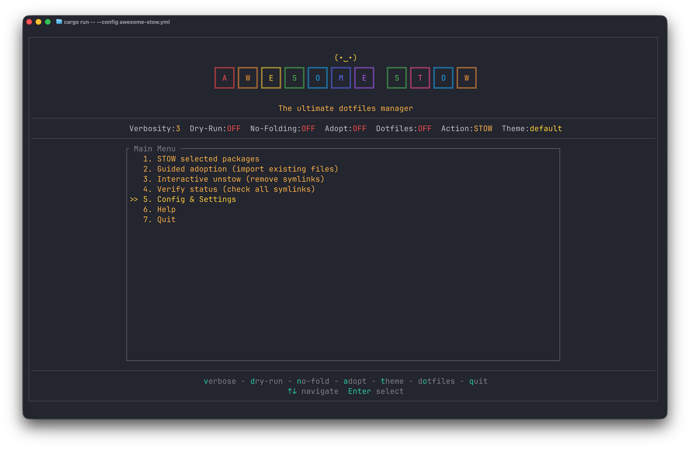
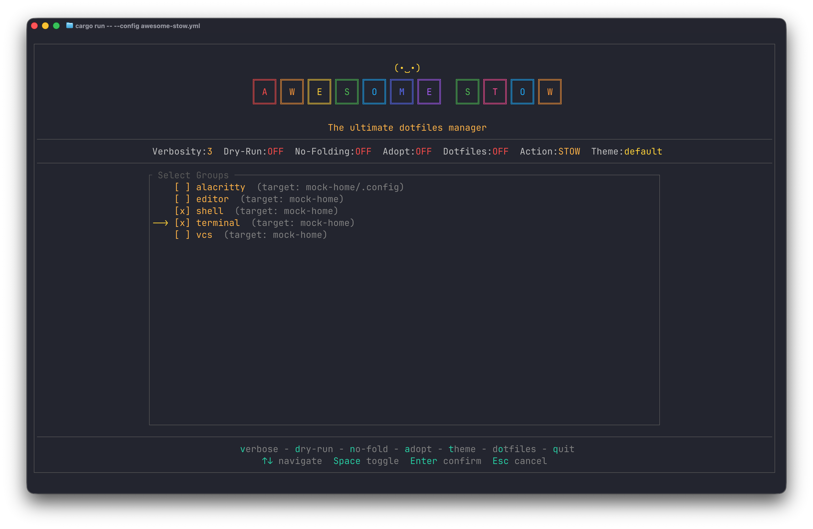
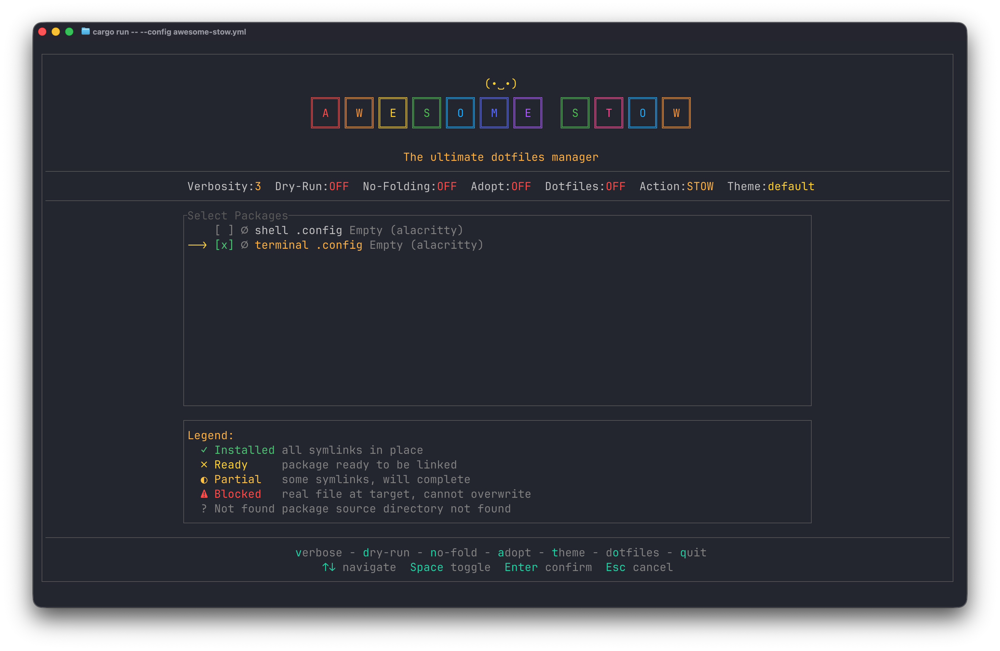
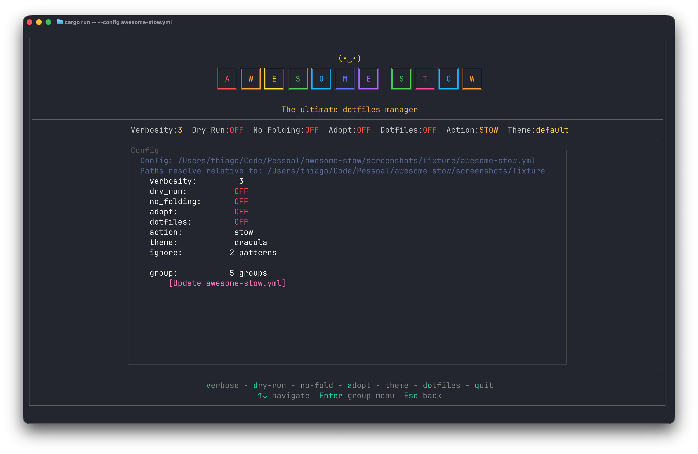
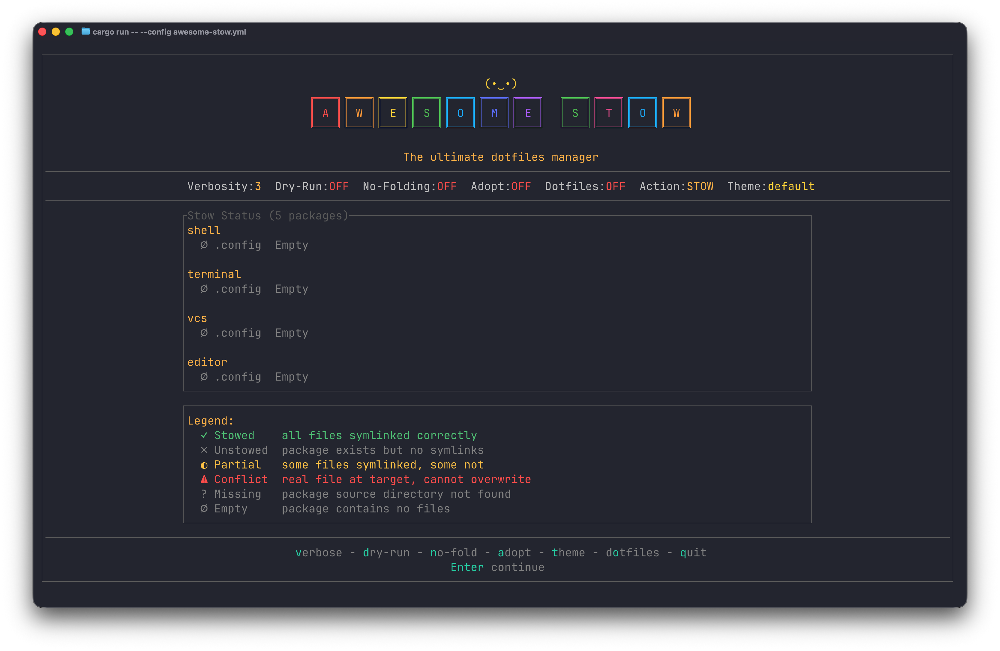
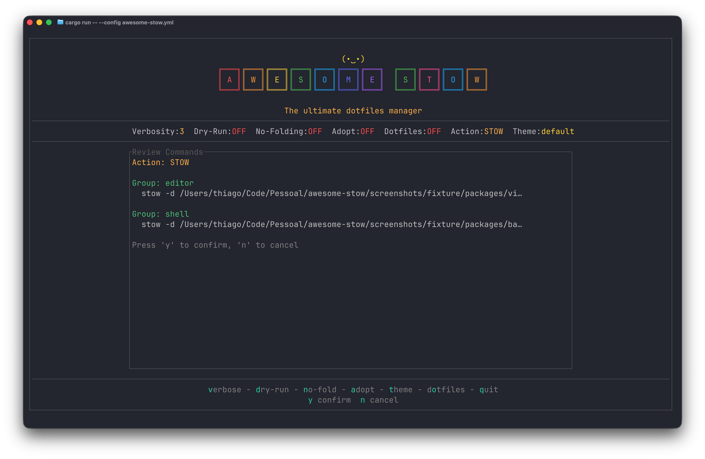

<p align='center'>
  
</p>

<p align='center'>
  
  
</p>

# andre 🚀

A TUI wrapper for [GNU Stow](https://www.gnu.org/software/stow/) — manage your dotfiles visually.

## 📋 Table of Contents

- [What is andre?](#what-is-andre)
- [Features](#features)
- [Screenshots](#screenshots)
- [Installation](#installation)
- [Quick Start](#quick-start)
- [Main Menu](#main-menu)
- [Key Bindings](#key-bindings)
- [Detailed Reference](#detailed-reference)
- [License](#license)

<a name="what-is-andre"></a>
## 🎯 What is andre?

**GNU Stow** is a CLI symlink farm manager. It creates symlinks from a source directory to a target directory — most commonly used to keep dotfiles in a version-controlled repo while making them appear in your home directory.

**andre** is a TUI wrapper around Stow. Instead of remembering CLI flags and running stow manually per package group, you get a visual interface to select groups, pick packages, toggle options, and execute with live feedback.

See [REFERENCE.md](REFERENCE.md) for a detailed walkthrough and full configuration reference.

<a name="features"></a>
## ✨ Features

- **Multi-group config** — Define multiple stow targets (e.g., `~`, `~/.config`) each with its own source directory
- **Interactive package selection** — Browse packages per group, select/unselect with Space, smart pre-selection based on action
- **Live settings toggles** — Toggle dry-run, verbosity, adopt, no-folding on the fly from any screen
- **Config editor built-in** — Edit `andre.yml` from within the TUI: add/remove/edit groups, change global defaults
- **Headless mode (`--yolo`)** — Auto-stow all packages without interaction, for scripts and automation
- **Config file discovery** — Auto-finds `andre.yml` in standard locations (`$PWD`, `~/dotfiles/`, `~/.dotfiles/`, `$XDG_CONFIG_HOME`)
- **Real stow status display** — See which packages are stowed, unstowed, conflicted, or missing at a glance

<a name="screenshots"></a>
## 📸 Screenshots

| Screen | Preview |
|--------|---------|
| *Main Menu* |  |
| *Group Selection* |  |
| *Package Selection* |  |
| *Settings* |  |
| *Status* |  |
| *Execute* |  |

<a name="installation"></a>
## 📦 Installation

### Quick download (macOS / Linux)

Grab the binary for your platform from the [latest release](https://github.com/lthiagol/andre/releases):

```bash
# macOS (Apple Silicon)
curl -LO https://github.com/lthiagol/andre/releases/download/v0.2.0/andre-aarch64-macos
chmod +x andre-aarch64-macos
sudo mv andre-aarch64-macos /usr/local/bin/andre

# Linux (x86_64)
curl -LO https://github.com/lthiagol/andre/releases/download/v0.2.0/andre-x86_64-linux
chmod +x andre-x86_64-linux
sudo mv andre-x86_64-linux /usr/local/bin/andre
```

Make sure [GNU Stow](https://www.gnu.org/software/stow/) is installed on your system.

### Homebrew (macOS)

The tap is hosted on Codeberg, so add it once with the full URL:

```bash
brew tap lthiagol/tap https://github.com/lthiagol/homebrew-tap
brew install lthiagol/tap/andre
```

Automatically installs GNU Stow and Rust as dependencies.  
**Note**: Homebrew builds Rust from source, which pulls in LLVM and z3 as transitive dependencies (~1 GB total). To avoid this, install Rust via [rustup](https://rustup.rs) instead, then use the binary from a [release](https://github.com/lthiagol/andre/releases) or `cargo install`.

### From source

```bash
git clone https://github.com/lthiagol/andre
cd andre
make install
```

### Via cargo

```bash
cargo install --git https://github.com/lthiagol/andre
```

<a name="quick-start"></a>
## 🚀 Quick Start

Create an `andre.yml` in your dotfiles directory:

```yaml
# Minimal working example — see REFERENCE.md for full reference
global:
  stow:
    verbosity: 0
    dry_run: false
    no_folding: false
    adopt: false
    action: stow

groups:
  dotfiles:
    source: packages/dotfiles
    target: ~
```

andre auto-discovers the config in several locations (current directory, `~/dotfiles/`, etc.). To use a specific path:

```bash
andre --config ~/dotfiles/andre.yml
```

Launch without arguments:

```bash
andre
```

Select your group, pick packages, and stow them.

<a name="main-menu"></a>
## 🗺️ Main Menu

| Option | What it does |
|--------|-------------|
| **Stow packages** | Select groups and packages, then stow to targets |
| **Guided adoption** | Import existing target files into a new package |
| **Interactive unstow** | Remove symlinks interactively |
| **Verify status** | View stow status across all groups |
| **Config & Settings** | Edit config, add/remove groups, change options |
| **Help** | Keyboard reference |
| **Quit** | Exit andre |

<a name="key-bindings"></a>
## ⌨️ Key Bindings

| Key | Action |
|:---|:---|
| `↑↓` or `kj` | Navigate |
| `Enter` | Confirm / Select |
| `Space` | Toggle selection |
| `Escape` | Back / Cancel |
| `v` | Cycle verbosity (0-5) |
| `d` | Toggle dry-run |
| `t` | Cycle theme |
| `q` / `Ctrl+C` | Quit / Cancel execution |

Global shortcuts work from list screens. They are blocked during text input (e.g., typing a package name in the adoption prompt) and modal popups (e.g., settings picker).

<a name="detailed-reference"></a>
## 📖 Detailed Reference

For full documentation — complete configuration reference, all key bindings, themes, testing guide, build dependencies, and contributing — see [REFERENCE.md](REFERENCE.md).

<a name="license"></a>
## 📝 License

MIT
